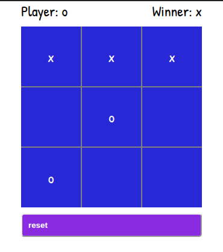

# IMPACTOR

A monorepo that hosts multiple workspaces (apps, components, and libs) and managed by [NX](https://nx.dev/), [PNPM](https://pnpm.io/), and [Bit](https://bit.dev/).

you are welcome to contribute and join our community, read the [contributing guide](/CONTRIBUTING.md)

give us a star

## project structure

- **libs:**

  contains libraries and plugins.

- **apps:**

  contains the applications.

- **comps:**

  contains Bit components

  ### structure notes:
  - every scope has its own README.md and configuration files, but all configurations are extend the workspace's config, such as tsconfig and webpack.config.

## contributing

please read our [code of conduct](/CODE_OF_CONDUCT.md)

## AI

### authenticate opencode

- get the auth key from https://opencode.ai/workspace
- create `.opencode-key` in the root dir and paste your key`
- open `opencode` in the integrated terminal

## Apps

### Tic Tac Toe game

A Tic Tac Toc game with pure Javascript

[full documentaion and demos](./apps/tic-tac-toe-game/README.md)

---
